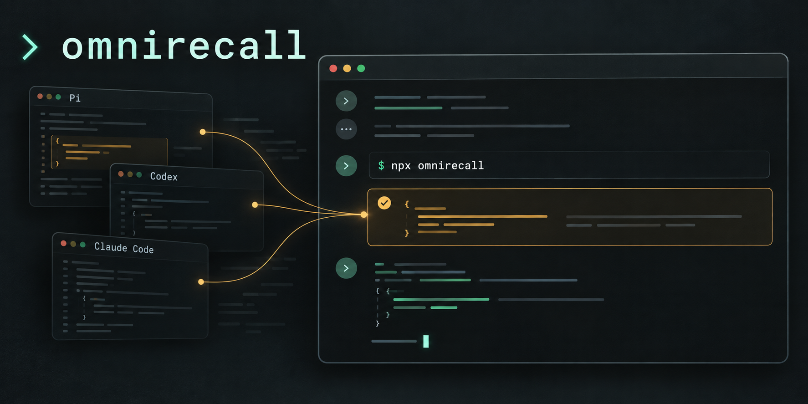

# omnirecall

[](https://github.com/spences10/omnirecall/actions/workflows/verify.yml)
[](https://viteplus.dev)
[](https://vitest.dev)

Find answers in your past coding conversations—even when they happened
in a different agent.

OmniRecall searches Pi, Codex, and Claude Code session histories in
one local archive. Recover a decision, find a command that worked, or
give your current assistant the context it needs to continue earlier
work.



- Search across agents without remembering which one you used.
- Read the conversation around a match and inspect original tool
  output.
- Keep imported history searchable after its source files disappear.
- Keep your archive on your machine; no account or hosted service
  needed.

## Use in your coding assistant

Ask directly in your current CLI conversation:

> Use pnpx omnirecall to find that session where we changed the
> database queries and fixed slow search. What did we change?

Or use `npx omnirecall` in the same request. Your assistant runs the
commands, searches earlier sessions, and reads the relevant context
without you leaving the conversation.

> Use npx omnirecall to find how we fixed the authentication bug last
> week, and use that context to help with this issue.

Requires Node.js 24.11 or newer.

## Desktop plugin

The [OmniRecall plugin](plugins/omnirecall/README.md) adds a recall
skill for local assistant tasks in the desktop app. It uses the
published CLI to find earlier conversations and return source context.
It requires terminal access to the machine holding your history.

In the ChatGPT desktop app, open **Plugins → Add → Add plugin
marketplace**. Enter `spences10/omnirecall` as the source, `main` as
the Git ref, and leave sparse paths empty. Add the marketplace,
install **OmniRecall**, and start a new local task.

Or install with Codex CLI:

```sh
codex plugin marketplace add spences10/omnirecall --ref main
codex plugin add omnirecall@personal
```

See the [installation guide](docs/plugin-installation.md) for updates,
requirements, and troubleshooting.

## Run commands directly

```bash
pnpx omnirecall sync
pnpx omnirecall search "database migration"
pnpx omnirecall read '<ref from search>' --context 2
```

Run `sync` to pick up new conversations. Add `--json` for structured
results. Search defaults to conversation messages; use `--kind all` to
include tool activity. Each command's `--help` lists its options.
Search supports FTS5 expressions: `"source path"`,
`sqlite OR database`, and `migrat*`.

Supports Pi v3, Codex paginated histories, and Claude Code
transcripts, including separate subagent sessions. Claude team/task
files and legacy Codex histories are not currently supported.
