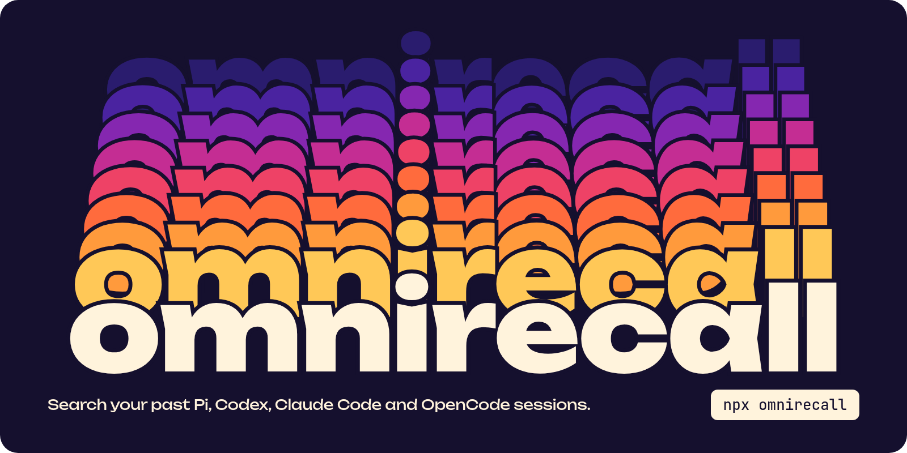

# omnirecall

[](https://github.com/spences10/omnirecall/actions/workflows/verify.yml)
[](https://viteplus.dev)
[](https://vitest.dev)

Find answers in your past coding conversations—even when they happened
in a different agent.

OmniRecall searches Pi, Codex, Claude Code, and OpenCode session
histories in one local archive. Recover a decision, find a command
that worked, or give your current assistant the context it needs to
continue earlier work.



- Search across agents without remembering which one you used.
- Read the conversation around a match and inspect original tool
  output.
- Keep imported history searchable after its source files disappear.
- Keep your archive on your machine; no account or hosted service
  needed.

## Use in your coding assistant

Ask directly in your current CLI conversation:

> Use pnpx omnirecall to find that session where we changed the
> database queries and fixed slow search. What did we change?

Or use `npx omnirecall` in the same request. Your assistant runs the
commands, searches earlier sessions, and reads the relevant context
without you leaving the conversation.

> Use npx omnirecall to find how we fixed the authentication bug last
> week, and use that context to help with this issue.

Requires Node.js 24.11 or newer.

## Desktop plugin

The [OmniRecall plugin](plugins/omnirecall/README.md) adds a recall
skill for local assistant tasks in the desktop app. It uses the
published CLI to find earlier conversations and return source context.
It requires terminal access to the machine holding your history.

In the ChatGPT desktop app, open **Plugins → Add → Add plugin
marketplace**. Enter `spences10/omnirecall` as the source, `main` as
the Git ref, and leave sparse paths empty. Add the marketplace,
install **OmniRecall**, and start a new local task.

Or install with Codex CLI:

```sh
codex plugin marketplace add spences10/omnirecall --ref main
codex plugin add omnirecall@personal
```

See the [installation guide](docs/plugin-installation.md) for updates,
requirements, and troubleshooting.

## Run commands directly

```bash
pnpx omnirecall sync
pnpx omnirecall search "database migration"
pnpx omnirecall read '<ref from search>' --context 2
```

Run `sync` to pick up new conversations. Add `--json` for structured
results. Search defaults to conversation messages; use `--kind all` to
include tool activity. Each command's `--help` lists its options.
Search supports FTS5 expressions: `"source path"`,
`sqlite OR database`, and `migrat*`. Package/path terms containing
`-`, `.`, `/`, or `@` are quoted automatically inside expressions, so
`my-pi AND deps` works without extra quoting.

Codex approval-reviewer context is excluded from default dialogue
searches. Use `--kind review_context` (or `--kind all`) to find those
copies, and `read --raw` to inspect their original records.

Find a session by title and date, then use its `short_id` to search:

```bash
pnpx omnirecall sessions --title "migration" --after 2026-09-25 --before 2026-09-25
pnpx omnirecall search "sqlite" --session '<short_id>'
```

When you don't know which session it was, list matching sessions
first. Each appears once with its hit count and best snippet:

```bash
pnpx omnirecall search "sqlite" --by-session
pnpx omnirecall search "sqlite" --session '<short_id>'
```

To see what a long session covered before reading it, outline it. You
get its user prompts and summaries, one line each, with refs to read:

```bash
pnpx omnirecall outline '<short_id>'
```

`--title` matches a literal substring (ASCII case-insensitive) on
`sessions`, `search`, and `recall`. Session date filters use the
stored session timestamp; search/recall date filters use message
timestamps. Date-only bounds cover the whole UTC day.

`--session` accepts the existing full session ID, an archive ID, or a
unique native/archive ID prefix. Ambiguous identifiers fail rather
than selecting a session: use a longer prefix or narrow `--agent`,
`--source`, or `--project`. Title/date filters do not resolve
identifier ambiguity. Printed `short_id` values are unique across the
current archive; re-list sessions if a later import makes an older
prefix ambiguous.

Search and recall are compact by default; use `sessions --compact` for
smaller session listings. These use JSON schema v3: identical metadata
lives in optional `shared.results` / `shared.messages` objects, with
per-row values taking precedence. Source paths are included, and
recall avoids repeating content in snippets unless the message excerpt
omits the hit. Compact output prints short `m2`/`r2` refs; pass them
to `read` unchanged. Canonical `m1`/`r1` refs still work.

Detailed search and recall (`--full`) and ordinary sessions stay on
schema v1; `read` stays on schema v2. See
[the output contract](docs/archive-design.md#compact-output) for
decoding shared metadata.

Supports Pi v3, Codex paginated histories, Claude Code transcripts
(including separate subagent sessions), and OpenCode v2 SQLite session
projections verified against OpenCode 2.0.22. Claude team/task files,
legacy Codex histories, and older OpenCode SQLite/JSON layouts are not
supported.

### OpenCode

Sync automatically discovers `$XDG_DATA_HOME/opencode/opencode.db`,
defaulting to `~/.local/share/opencode/opencode.db`. To select
OpenCode or use a different data directory:

```bash
pnpx omnirecall sync --agent opencode
pnpx omnirecall sync --opencode-root /path/to/opencode
pnpx omnirecall search "migration" --agent opencode
```

The source database is opened read-only, including committed WAL data.
Imports retain conversation text, reasoning, tool calls/results and
original session/message rows. Streaming updates are picked up on the
next sync; malformed input retains the last successful import. Revert
activity is marked unknown rather than guessing the active branch.
Event-log replay and pending inbox messages are not imported.
